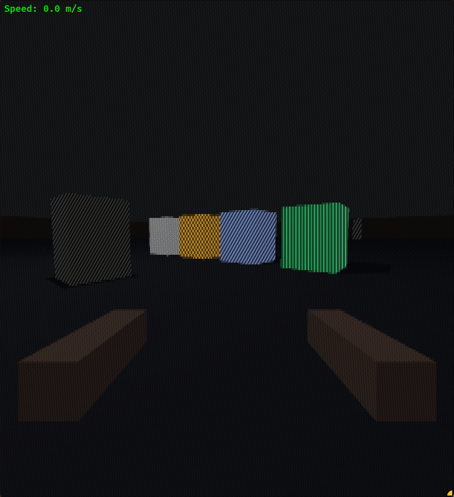
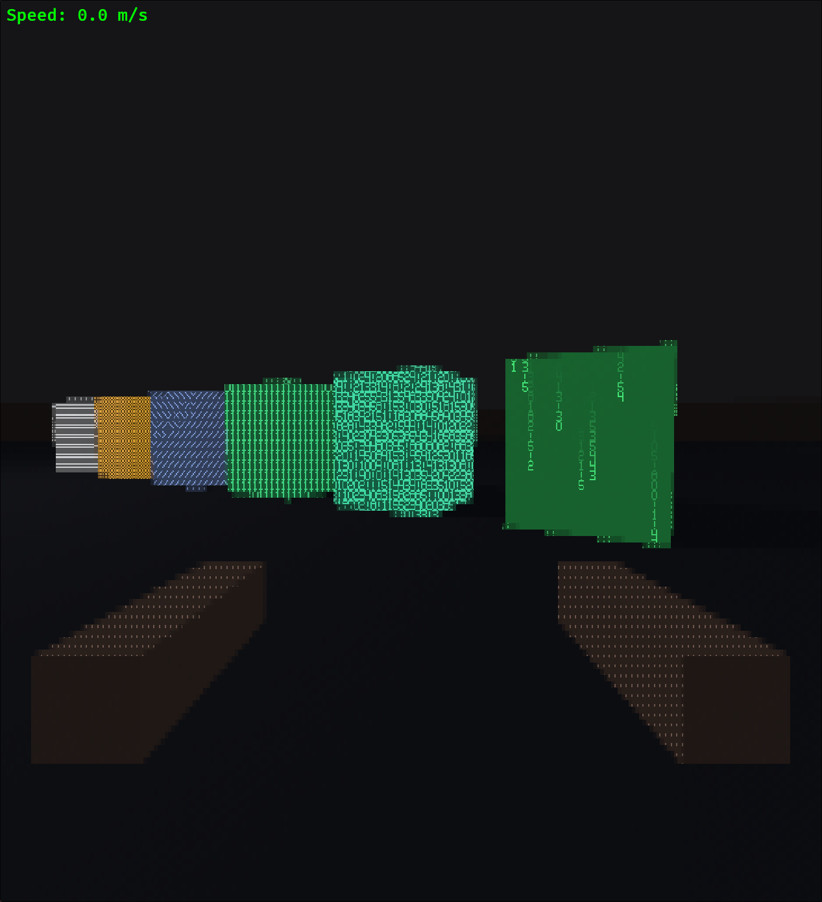

# Part 3: Animated Patterns & The Matrix Effect

*Making ASCII come alive*

---

The static ASCII patterns were working well, but something was missing. The game needed movement, life - something to make the surfaces feel dynamic. Time to add animated patterns, culminating in the iconic Matrix rain effect.

---

## Adding Time to the Shader

**Commit: `2cc7cb1`**

The first step was passing time into the shader. In Bevy, this means adding a field to the settings struct and updating it every frame:

```rust
#[derive(Component, Clone, Copy, ExtractComponent, ShaderType)]
pub struct AsciiSettings {
    pub cell_size: Vec2,
    pub resolution: Vec2,
    pub monochrome: f32,
    pub per_object_mode: f32,
    pub global_pattern: f32,
    pub time: f32,  // New: animation time
}

pub fn update_ascii_time(time: Res<Time>, mut settings: Query<&mut AsciiSettings>) {
    let elapsed = time.elapsed_secs();
    for mut setting in &mut settings {
        setting.time = elapsed;
    }
}
```

The shader now has access to elapsed time, opening up possibilities for animation.

---

## Pattern 4: Matrix Cycle

The first animated pattern cycles through digital characters. Each cell displays a randomly-selected number that changes over time:

```wgsl
fn get_char_pixel_pattern4(char_index: u32, local_x: u32, local_y: u32,
                            cell_x: f32, cell_y: f32, time: f32) -> f32 {
    // Each column falls at a different speed
    let column_seed = fract(sin(cell_x * 12.9898) * 43758.5453);
    let fall_speed = 3.0 + column_seed * 4.0;
    let fall_offset = column_seed * 50.0;

    // Character changes based on time and position
    let time_offset = floor(time * 8.0 + cell_y * fall_speed + fall_offset);
    let char_variation = u32(fract(sin(cell_x * 78.233 + time_offset * 45.164)
                            * 43758.5453) * 8.0) + 1u;

    // Render the animated character
    let animated_char = select(0u, char_variation, char_index > 0u);
    // ... bitmap lookup
}
```

The `fract(sin(...) * 43758.5453)` pattern is a classic GPU pseudo-random number generator. It's deterministic (same input = same output) but appears random, perfect for consistent-looking noise.


*The first working animated pattern - characters cycling through numbers*

---

## The Size Problem

**Commit: `c4b2d71`**

Here's where things got frustrating. The patterns looked great in Chunky mode (12x20 cells), but at higher resolutions like Ultra (3x5), the 5x7 character bitmaps became unreadable smears.


*At small cell sizes, the bitmap characters were too tiny to read*

The initial fix was rendering characters at a fixed Classic size (8x14), but that made all high-res modes look identical. The final solution: **scale the reference size based on cell size**, so higher resolutions get progressively smaller (but still readable) characters:

```wgsl
var char_pixel: f32;
if settings.cell_size.x < 8.0 {
    // Scale reference size based on cell size
    // Ultra (3x5) -> ~5x9, HighRes (5x9) -> ~6x11, approaching Classic (8x14)
    let min_ref = vec2<f32>(5.0, 9.0);   // Minimum readable size
    let max_ref = vec2<f32>(8.0, 14.0);  // Classic size
    let t = (settings.cell_size.x - 3.0) / 5.0; // 0 at Ultra, 1 at Classic
    let reference_size = mix(min_ref, max_ref, clamp(t, 0.0, 1.0));

    let tiled_pos = fract(pixel_coord / reference_size) * reference_size;
    let ref_char_x = u32(tiled_pos.x / reference_size.x * 5.0);
    let ref_char_y = u32(tiled_pos.y / reference_size.y * 7.0);
    let ref_cell = floor(pixel_coord / reference_size);
    char_pixel = get_char_pixel(pattern_id, char_index,
                                ref_char_x, ref_char_y,
                                ref_cell.x, ref_cell.y, settings.time);
} else {
    // Use cell-sized bitmaps for Classic and larger
    char_pixel = get_char_pixel(pattern_id, char_index,
                                char_local_x, char_local_y,
                                cell_coord.x, cell_coord.y, settings.time);
}
```

The `mix()` function interpolates between minimum (5x9) and Classic (8x14) sizes. Now Ultra feels denser and more detailed than HighRes, which feels denser than Classic - each preset has its own character.

---

## Pattern 5: True Matrix Rain

**Commit: `1de5bdb`**

The cycling pattern was nice, but it wasn't *rain*. True Matrix rain has:

1. **Falling columns** - characters move downward
2. **Bright heads** - the leading character is brightest
3. **Fading tails** - characters dim as they fall behind
4. **Varying speeds** - each column falls at its own pace

```wgsl
fn get_char_pixel_pattern5(char_index: u32, local_x: u32, local_y: u32,
                            cell_x: f32, cell_y: f32, time: f32) -> f32 {
    // Each column has unique properties
    let column_seed = fract(sin(cell_x * 12.9898 + 78.233) * 43758.5453);
    let column_seed2 = fract(sin(cell_x * 63.7264 + 10.873) * 43758.5453);

    // Column properties
    let fall_speed = 8.0 + column_seed * 12.0;      // 8-20 cells/second
    let trail_length = 8.0 + column_seed2 * 16.0;   // 8-24 cell trail
    let start_offset = column_seed * 100.0;         // Staggered starts

    // Where is the "head" of this column's rain drop?
    let head_position = (time * fall_speed + start_offset) % (trail_length + 40.0);

    // Distance from head (positive = in the trail behind)
    let dist_from_head = head_position - cell_y;

    // Brightness fades along the trail
    var trail_brightness = 0.0;
    if dist_from_head >= 0.0 && dist_from_head < trail_length {
        trail_brightness = 1.0 - (dist_from_head / trail_length);
        trail_brightness = trail_brightness * trail_brightness; // Quadratic falloff
    }

    // Only render if we're in the trail
    if trail_brightness < 0.1 || char_index == 0u {
        return 0.0;
    }

    // Random character that occasionally changes
    let char_change_rate = 4.0;
    let char_time = floor(time * char_change_rate + cell_y * 0.5 + cell_x * 0.3);
    let char_variation = u32(fract(sin(cell_x * 78.233 + cell_y * 45.164
                            + char_time * 93.7193) * 43758.5453) * 8.0) + 1u;

    // ... bitmap lookup ...

    // Modulate by trail brightness for the fade effect
    return pixel * trail_brightness;
}
```

The key insight is the `head_position` calculation. It advances with time, wrapping around with modulo. The `dist_from_head` tells us where we are relative to the bright leading edge - positive values are "behind" in the fading trail.


*The completed Matrix Fall pattern - true falling columns with fading trails*

---

## Six Patterns Total

The game now has six distinct ASCII patterns:

| ID | Name | Description |
|----|------|-------------|
| 0 | Standard | Classic ` .:-=+*#%@` density ramp |
| 1 | Blocks | Checkerboards and box-drawing characters |
| 2 | Slashes | Diagonal lines and X patterns |
| 3 | Binary | Numbers 0-9 for that digital look |
| 4 | Matrix Cycle | Animated cycling characters |
| 5 | Matrix Fall | Rain with fading trails |

Each pattern can be assigned per-object, so walls might use blocks while computer terminals use Matrix Fall.

---

## Pattern Encoding Update

With six patterns, the encoding scheme needed adjustment:

```wgsl
// pattern_material.wgsl
let pattern_value = pattern.pattern_id / 6.0;  // Was /5.0

// ascii.wgsl
pattern_id = u32(pattern_sample.r * 6.0 + 0.5);  // Decode
```

The pattern ID (0-5) is encoded as a value from 0.0 to 0.833 in the red channel. The `+ 0.5` in decoding handles rounding to the nearest integer.

---

## Showcase Pillars

To demonstrate all patterns, I added showcase cubes near the spawn point:

```rust
// Pattern 5: Matrix Fall - bright green (true falling rain effect)
let matrix_fall_material = materials.add(StandardMaterial {
    base_color: Color::srgb(0.0, 1.0, 0.3),
    emissive: LinearRgba::rgb(0.0, 0.5, 0.1),
    perceptual_roughness: 0.2,
    ..default()
});
commands.spawn((
    Mesh3d(meshes.add(Cuboid::new(showcase_size, showcase_height, showcase_size))),
    MeshMaterial3d(matrix_fall_material),
    Transform::from_xyz(showcase_spacing * 3.5, showcase_y, showcase_z),
    LevelGeometry,
    BoxCollider { half_extents: Vec3::splat(showcase_size / 2.0) },
    AsciiPatternId::matrix_fall(),
));
```

The emissive material properties ensure patterns remain visible even in darker areas.

---

## Interlude: Movement like a Surf Server

While the visuals were coming together, the movement felt too restrictive. I initially had a Quake3 based movement system. But for this project, I wanted something more fluid - closer to community Bhop and Surf servers in CounterStrike.

The goal: allow the player to gain speed by strafing in the air and maintain that momentum smoothly.

### The Physics of Air Strafe

The "magic" of Source-style movement lies in how acceleration is calculated in the air. We don't just add velocity; we check how much "room" is left to accelerate in the direction the player is looking.

In this update, I decoupled the speed cap from the acceleration amount:

```rust
pub fn air_accelerate(
    velocity: Vec3,
    wish_dir: Vec3,
    wish_speed: f32,
    accel: f32,
    air_wishspeed_cap: f32,
    air_speed_cap: f32,
    dt: f32,
) -> Vec3 {
    // 1. Cap wish_speed for the 'room' calculation
    // Lower cap = smoother, tighter curves (classic Surf feel)
    let capped_wish_speed = wish_speed.min(air_wishspeed_cap);

    // 2. How much speed can we still add in this direction?
    let current_speed = velocity.dot(wish_dir);
    let add_speed = capped_wish_speed - current_speed;

    if add_speed <= 0.0 { return velocity; }

    // 3. Accelerate using the FULL wish_speed
    // This allows gaining velocity when strafing perpendicular to movement
    let accel_speed = (accel * wish_speed * dt).min(add_speed);
    let new_vel = velocity + wish_dir * accel_speed;

    // 4. Soft cap on horizontal speed
    let horiz_speed = Vec2::new(new_vel.x, new_vel.z).length();
    if horiz_speed > air_speed_cap {
        let scale = air_speed_cap / horiz_speed;
        return Vec3::new(new_vel.x * scale, new_vel.y, new_vel.z * scale);
    }
    
    new_vel
}
```

I did some other tweaks as well, mostly to the "settings" of my movement related variables:
- *Higher `sv_airaccelerate`*: Jumped from `0.5` to `12.0`. This makes the player responsive in the air.
- *The "Wishspeed" Cap*: By capping the "headroom" check to a low value (`1.5`), but using the full speed for the actual math, you can gain speed by strafing sideways.
- *Removed Landing Penalties*: In tactical CS, landing slows you down to prevent bunny hopping. I stripped out `just_landed` and `jump_released` checks. If you hold space, you keep your momentum.
- *Gravity & Hangtime*: Lowered `sv_gravity` from `16.0` to `12.0` to give the movement a more "floaty" surf feel.

---

## Performance Notes

Animated patterns add per-pixel calculations every frame, but performance remains solid:

- The pseudo-random functions (`fract(sin(...))`) are cheap on GPU
- No texture lookups beyond what we already had
- Time uniform updates once per frame (negligible CPU cost)
- Trail calculations are simple arithmetic
- The movement system uses simple vector dot products, keeping the CPU free to handle the ASCII transformation logic.

On my machine, there's no measurable frame rate difference between static and animated patterns.

---

## Lessons Learned

1. **Reference-size rendering solves legibility.** Tiling larger characters across small cells keeps patterns readable at any resolution.

2. **Quadratic falloff looks better than linear.** `brightness * brightness` creates a more natural fade than just `brightness`.

3. **Deterministic randomness is key.** The `fract(sin(...))` pattern gives consistent results - the same column always falls at the same speed.

4. **Modulo creates loops.** `(time * speed + offset) % cycle_length` creates infinitely repeating animations.

5. **Multiple seeds prevent correlation.** Using different seed values for speed vs. trail length prevents all-fast-short or all-slow-long columns.

6. **Movement matters.** If the movement doesn't feel right, it won't be fun to play. Tweaking this as we go will be key to the UX.

---

## Current State

Six ASCII patterns are working:
- Four static patterns (Standard, Blocks, Slashes, Binary)
- Two animated patterns (Matrix Cycle, Matrix Fall)
- All assignable per-object via render layers
- All resolution-independent with reference-size tiling

What's next:
- Combat prototype (weapons, damage)
- Enemy AI (something to shoot at)
- Sound design (pew pew)

---

*The source code is available at [github.com/Jurkyy/ascii_shooter](https://github.com/Jurkyy/ascii_shooter)*
