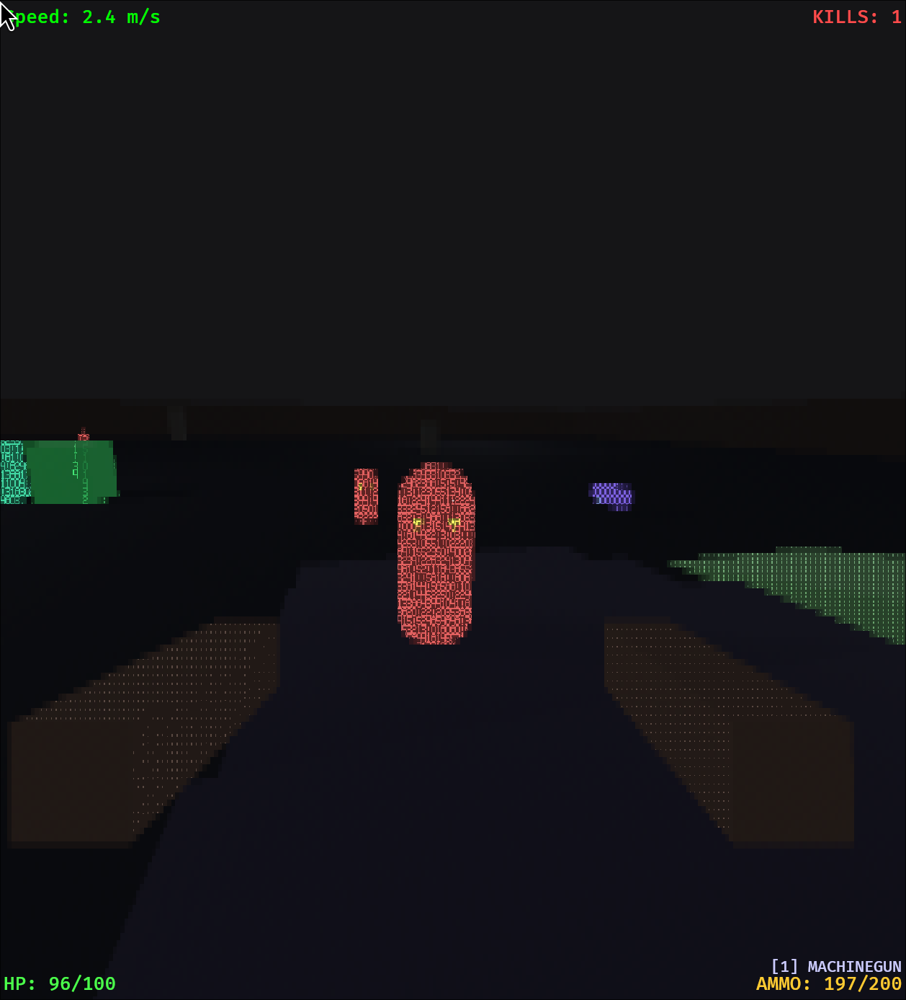

# Part 4: Combat & Verticality

*Guns, enemies, and the third dimension*

---

After getting the ASCII rendering and movement feeling right, it was time to add the core gameplay loop: combat. This phase brought weapons, enemy AI, health systems, and eventually full 3D level geometry with slopes and multi-level platforms.

---

## Phase 4: The Combat Prototype

**Commit: `27d05f0`**

The initial combat implementation needed several interconnected systems:

1. **Health & Damage** - HP/Armor for player and enemies
2. **Weapons** - Shooting mechanics with cooldowns
3. **Enemies** - Something to shoot at
4. **Visual Feedback** - Damage flashes, hit reactions

### The Damage System

I started with a simple component-based health system:

```rust
#[derive(Component)]
pub struct Health {
    pub current: f32,
    pub max: f32,
}

#[derive(Component)]
pub struct Armor {
    pub current: f32,
    pub max: f32,
}

#[derive(Event)]
pub struct DamageEvent {
    pub target: Entity,
    pub amount: f32,
    pub source: Option<Entity>,
}
```

Damage flows through events rather than direct mutation. This decouples the shooting system from the health system and makes it easy to add effects like damage numbers or hit sounds later.

The damage processing respects armor:

```rust
fn process_damage_events(
    mut events: EventReader<DamageEvent>,
    mut health_query: Query<(&mut Health, Option<&mut Armor>)>,
    mut death_events: EventWriter<DeathEvent>,
) {
    for event in events.read() {
        if let Ok((mut health, armor)) = health_query.get_mut(event.target) {
            let mut damage = event.amount;

            // Armor absorbs damage first
            if let Some(mut armor) = armor {
                let armor_absorb = damage.min(armor.current);
                armor.current -= armor_absorb;
                damage -= armor_absorb;
            }

            health.current -= damage;

            if health.current <= 0.0 {
                death_events.send(DeathEvent {
                    entity: event.target,
                    killer: event.source,
                });
            }
        }
    }
}
```

---

## Hitscan Weapons

**Commit: `27d05f0`**

The first weapon was a simple hitscan machinegun. Hitscan means the bullet travels instantly - we cast a ray and check what it hits:

```rust
fn handle_shooting(
    mouse: Res<ButtonInput<MouseButton>>,
    mut weapon_query: Query<&mut WeaponInventory, With<Player>>,
    camera_query: Query<&GlobalTransform, With<PlayerCamera>>,
    shootable_query: Query<(Entity, &Transform), With<Shootable>>,
    mut damage_events: EventWriter<DamageEvent>,
) {
    if !mouse.pressed(MouseButton::Left) { return; }

    let camera_transform = camera_query.single();
    let ray_origin = camera_transform.translation();
    let ray_direction = camera_transform.forward();

    // Find closest hit
    let mut closest_hit: Option<(Entity, f32)> = None;

    for (entity, transform) in &shootable_query {
        if let Some(distance) = ray_sphere_intersect(
            ray_origin, ray_direction,
            transform.translation, 1.0  // Enemy radius
        ) {
            if closest_hit.is_none() || distance < closest_hit.unwrap().1 {
                closest_hit = Some((entity, distance));
            }
        }
    }

    if let Some((entity, _)) = closest_hit {
        damage_events.send(DamageEvent {
            target: entity,
            amount: weapon.damage,
            source: Some(player_entity),
        });
    }
}
```

The `Shootable` component marks entities that can be hit. This keeps the raycast query focused and fast.

---

## Enemy AI States

**Commit: `a327b95`**

Enemies needed behavior beyond standing still. I implemented a simple state machine:

```rust
#[derive(Component, Default, Clone, Copy, PartialEq, Eq)]
pub enum EnemyState {
    #[default]
    Idle,
    Wander,
    Chase,
    Attack,
    Retreat,
    Dead,
}

#[derive(Component, Clone, Copy, PartialEq, Eq)]
pub enum EnemyType {
    Melee,   // Rushes player, attacks up close
    Ranged,  // Keeps distance, shoots projectiles
}
```

The AI update checks distance to player and line of sight:

```rust
fn enemy_ai_update(
    player_query: Query<&Transform, With<Player>>,
    mut enemy_query: Query<(&Transform, &mut EnemyState, &Enemy, &EnemyType)>,
) {
    let player_pos = player_query.single().translation;

    for (transform, mut state, enemy, enemy_type) in &mut enemy_query {
        let distance = transform.translation.distance(player_pos);

        match *enemy_type {
            EnemyType::Melee => {
                if distance < enemy.attack_range {
                    *state = EnemyState::Attack;
                } else if distance < enemy.detection_range {
                    *state = EnemyState::Chase;
                } else {
                    *state = EnemyState::Wander;
                }
            }
            EnemyType::Ranged => {
                if distance < enemy.preferred_range * 0.5 {
                    *state = EnemyState::Retreat;  // Too close!
                } else if distance < enemy.detection_range {
                    *state = EnemyState::Attack;   // In range, shoot
                } else {
                    *state = EnemyState::Wander;
                }
            }
        }
    }
}
```

Ranged enemies are more interesting - they try to maintain distance. If the player gets too close, they retreat while still facing the player.

---

## Multiple Weapon Types

**Commit: `6c20c08`**

One weapon wasn't enough. I added a weapon inventory with three distinct types:

```rust
#[derive(Clone, Copy, PartialEq, Eq)]
pub enum WeaponType {
    Machinegun,     // Fast hitscan
    RocketLauncher, // Slow projectile with explosion
    Sword,          // Melee swing
}

#[derive(Component)]
pub struct WeaponInventory {
    pub weapons: Vec<WeaponStats>,
    pub current_index: usize,
}
```

Number keys switch weapons:

```rust
fn handle_weapon_switch(
    keyboard: Res<ButtonInput<KeyCode>>,
    mut query: Query<&mut WeaponInventory>,
) {
    for mut inventory in &mut query {
        if keyboard.just_pressed(KeyCode::Digit1) {
            inventory.current_index = 0;
        } else if keyboard.just_pressed(KeyCode::Digit2) {
            inventory.current_index = 1;
        } else if keyboard.just_pressed(KeyCode::Digit3) {
            inventory.current_index = 2;
        }
    }
}
```

### Projectile Weapons

The rocket launcher fires physical projectiles that travel through the world:

```rust
#[derive(Component)]
pub struct PlayerProjectile {
    pub velocity: Vec3,
    pub damage: f32,
    pub explosion_radius: f32,
    pub lifetime: f32,
}

fn update_player_projectiles(
    mut commands: Commands,
    mut projectile_query: Query<(Entity, &mut Transform, &mut PlayerProjectile)>,
    collider_query: Query<(&Transform, &BoxCollider)>,
    time: Res<Time>,
) {
    let dt = time.delta_secs();

    for (entity, mut transform, mut projectile) in &mut projectile_query {
        // Move projectile
        transform.translation += projectile.velocity * dt;
        projectile.lifetime -= dt;

        // Check collision with level geometry
        for (collider_transform, collider) in &collider_query {
            if aabb_point_collision(collider_transform, collider, transform.translation) {
                // Spawn explosion and despawn projectile
                spawn_explosion(&mut commands, transform.translation, projectile.explosion_radius);
                commands.entity(entity).despawn();
            }
        }
    }
}
```

Explosions deal area damage with distance falloff:

```rust
fn update_explosions(
    mut commands: Commands,
    explosion_query: Query<(Entity, &Transform, &Explosion)>,
    mut target_query: Query<(Entity, &Transform, &mut Health)>,
    mut damage_events: EventWriter<DamageEvent>,
) {
    for (explosion_entity, explosion_transform, explosion) in &explosion_query {
        for (target_entity, target_transform, _) in &target_query {
            let distance = explosion_transform.translation.distance(target_transform.translation);

            if distance < explosion.radius {
                // Damage falls off with distance
                let falloff = 1.0 - (distance / explosion.radius);
                let damage = explosion.damage * falloff * falloff;

                damage_events.send(DamageEvent {
                    target: target_entity,
                    amount: damage,
                    source: None,
                });
            }
        }

        commands.entity(explosion_entity).despawn();
    }
}
```

---

## Verticality: Platforms and Collision

**Commit: `9573f18`**

Up to this point, the game was essentially 2D - everything happened at ground level. To add proper verticality, I needed:

1. **Floor collision detection** for elevated platforms
2. **Ground height tracking** for proper physics
3. **Step-up logic** so players can walk up stairs

The key insight was separating wall collision (blocks horizontal movement) from floor collision (supports vertical position):

```rust
#[derive(Component)]
pub struct BoxCollider {
    pub half_extents: Vec3,
}

#[derive(Component)]
pub struct WallCollider;  // Blocks horizontal movement

#[derive(Component)]
pub struct GroundFloor;   // The main floor (excluded from platform checks)
```

The ground check system finds the highest floor surface below the player:

```rust
fn ground_check(
    mut query: Query<(&Transform, &mut PlayerState, &Velocity), With<Player>>,
    floor_query: Query<(&Transform, &BoxCollider, Option<&Slope>),
                       (Without<WallCollider>, Without<GroundFloor>)>,
) {
    for (transform, mut state, velocity) in &mut query {
        let player_pos = transform.translation;
        let feet_y = player_pos.y - config.player_height / 2.0;

        let mut ground_height = 0.0;  // Default ground
        let max_step_up = 0.6;

        for (floor_transform, floor_collider, slope) in &floor_query {
            let floor_pos = floor_transform.translation;
            let half = floor_collider.half_extents;

            // Check if player is within XZ bounds
            if (player_pos.x - floor_pos.x).abs() < half.x + player_radius
                && (player_pos.z - floor_pos.z).abs() < half.z + player_radius
            {
                let floor_top = match slope {
                    Some(s) => s.height_at(floor_pos, half, player_pos),
                    None => floor_pos.y + half.y,
                };

                // Can step up or land from above
                if floor_top <= feet_y + max_step_up && floor_top > ground_height {
                    ground_height = floor_top;
                }
            }
        }

        state.ground_height = ground_height;
        state.grounded = feet_y <= ground_height + 0.1 && velocity.0.y <= 0.1;
    }
}
```

The `ground_height` is stored in `PlayerState` so the movement system knows what "grounded" means. This enables proper ground physics (friction, acceleration) on elevated platforms.

---

## Slopes: Angled Surfaces

**Commit: `47cf7c1`**

Flat platforms were limiting. I wanted ramps the player could walk up smoothly.

TODO: Add surfing mechanic to steeper slopes.

The `Slope` component stores the angle:

```rust
#[derive(Component)]
pub struct Slope {
    pub direction: Vec2,      // Direction it rises (normalized)
    pub rise_per_unit: f32,   // Height gain per unit distance
}

impl Slope {
    pub fn height_at(&self, slope_center: Vec3, half_extents: Vec3, world_pos: Vec3) -> f32 {
        let relative = Vec2::new(
            world_pos.x - slope_center.x,
            world_pos.z - slope_center.z,
        );

        let distance_along = relative.dot(self.direction);
        let base_top = slope_center.y + half_extents.y;

        base_top + distance_along * self.rise_per_unit
    }
}
```

The visual mesh needed to match. I wrote a helper to generate wedge-shaped geometry:

```rust
fn create_ramp_mesh(width: f32, length: f32, height_back: f32, height_front: f32) -> Mesh {
    let hw = width / 2.0;
    let hl = length / 2.0;

    let slope_rise = height_front - height_back;
    let slope_normal = Vec3::new(0.0, length, -slope_rise).normalize();

    // Build vertices for each face...
    // Bottom (flat), Top (angled), Front, Back, Left, Right

    add_quad(&mut verts, &mut norms, &mut uvs, &mut indices,
        [-hw, height_back, -hl],
        [-hw, height_front, hl],
        [hw, height_front, hl],
        [hw, height_back, -hl],
        slope_normal.to_array());

    // ... remaining faces
}
```

Slopes also needed solid collision - you can't walk through them from the side or jump through from below:

```rust
// In player_collision:
for (slope_transform, collider, slope) in &slope_query {
    let slope_height = slope.height_at(slope_pos, half, player_pos);

    if player_feet < slope_height && player_feet > slope_bottom {
        let height_diff = slope_height - player_feet;

        if height_diff < 0.6 {
            continue;  // Small step, handled by ground_check
        }

        // Push out to nearest edge
        // ... standard AABB resolution
    }
}
```


*An enemy walking up stairs toward the player - the AI now respects level geometry*

---

## Enemy Floor Collision

Enemies needed the same treatment. They were previously locked to `y = 1.0`:

```rust
// OLD: Hardcoded ground level
transform.translation.y = 1.0;
```

The new system calculates ground height per-enemy:

```rust
fn enemy_collision(
    mut enemy_query: Query<&mut Transform, With<Enemy>>,
    floor_query: Query<(&Transform, &BoxCollider, Option<&Slope>)>,
) {
    for mut enemy_transform in &mut enemy_query {
        let mut ground_height = 0.0;

        for (floor_transform, floor_collider, slope) in &floor_query {
            // Same logic as player ground check
            let floor_top = match slope {
                Some(s) => s.height_at(...),
                None => floor_pos.y + half.y,
            };

            if can_step_onto(floor_top, enemy_feet) {
                ground_height = floor_top.max(ground_height);
            }
        }

        enemy_transform.translation.y = ground_height + enemy_height / 2.0;
    }
}
```

Now enemies walk up ramps chasing the player and stand on platforms naturally.

---

## Combat in Action

<video controls width="100%">
  <source src="../assets/images/combat.mp4" type="video/mp4">
  Combat demonstration
</video>

*The full combat loop: switching weapons, shooting enemies on platforms, explosions on slopes*

---

## The HUD

Combat needs feedback, ideally we do this through storytelling and graphics, but for now a HUD will suffice. I added a consolidated HUD showing:

TODO: Make HUD redundant 

- Health bar (red when low)
- Current weapon name
- Ammo count
- Crosshair (cycling ASCII characters)
- Kill counter

```rust
fn spawn_player_hud(mut commands: Commands) {
    commands.spawn((
        Node {
            position_type: PositionType::Absolute,
            bottom: Val::Px(10.0),
            left: Val::Px(10.0),
            ..default()
        },
    )).with_children(|parent| {
        // Health display
        parent.spawn((
            Text::new("HP: 100"),
            TextFont { font_size: 24.0, ..default() },
            HealthHud,
        ));

        // Weapon display
        parent.spawn((
            Text::new("[1] Machinegun"),
            WeaponHud,
        ));
    });
}
```

The crosshair cycles through ASCII characters for that terminal aesthetic:

```rust
const CROSSHAIR_CHARS: [char; 8] = ['+', 'x', '*', '#', '+', 'X', '*', '@'];

fn update_crosshair(mut query: Query<&mut Text, With<Crosshair>>, time: Res<Time>) {
    let index = ((time.elapsed_secs() * 8.0) as usize) % CROSSHAIR_CHARS.len();
    for mut text in &mut query {
        **text = CROSSHAIR_CHARS[index].to_string();
    }
}
```

---

## Performance Considerations

The collision systems run every frame, so efficiency matters:

1. **Separate queries** for walls, floors, and slopes avoid unnecessary component checks
2. **Early-out on XZ bounds** before calculating slope heights
3. **Step-up threshold** prevents expensive push-out calculations for walkable surfaces
4. **Entity markers** (`WallCollider`, `GroundFloor`) filter queries at the ECS level

With ~20 enemies and ~50 collision volumes, the game maintains 60+ FPS easily.

---

## Lessons Learned

1. **Separate wall and floor collision.** They serve different purposes - walls block movement, floors support position.

2. **Track ground height, not just "grounded".** Knowing the actual Y level enables proper physics on any surface.

3. **Step-up thresholds smooth movement.** Without them, every small height difference requires jumping.

4. **Slopes need solid collision too.** It's not enough to stand on them - you need to block movement through them.

5. **Enemies need the same physics as players.** Inconsistent collision makes the AI look broken.

6. **Events decouple systems.** Damage events let weapons, explosions, and environmental hazards all use the same health system.

---

## Current State

The game now has:
- Three weapon types (hitscan, projectile, melee)
- Two enemy types (melee rushers, ranged shooters)
- Full health/armor system with damage events
- Multi-level geometry with platforms and slopes
- Enemies that navigate vertical terrain
- HUD with health, weapons, and crosshair

What's next:
- Sound design (gunshots, explosions, enemy noises)
- More enemy variety (flying enemies?)
- Level design tools
- Win/lose conditions

---

*The source code is available at [github.com/Jurkyy/ascii_shooter](https://github.com/Jurkyy/ascii_shooter)*
